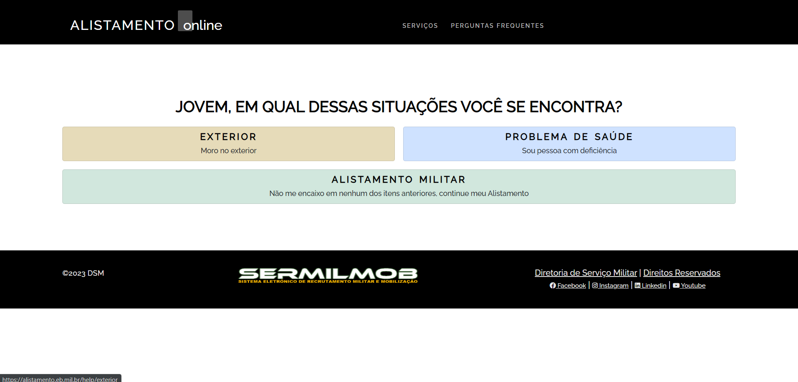
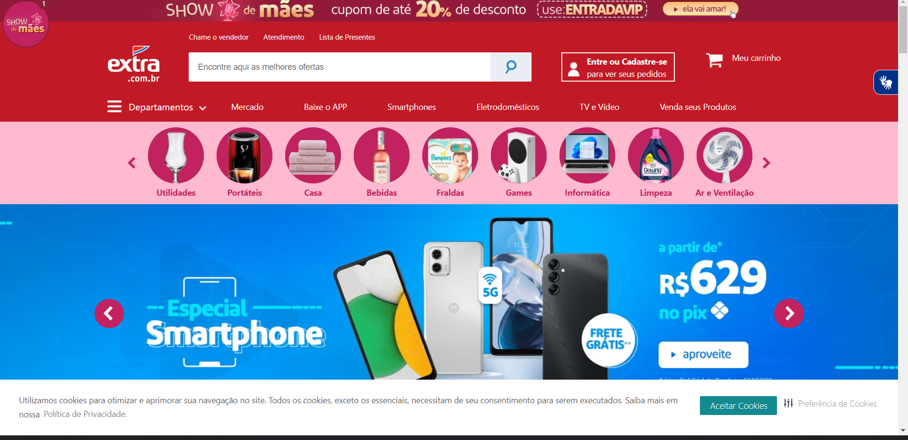
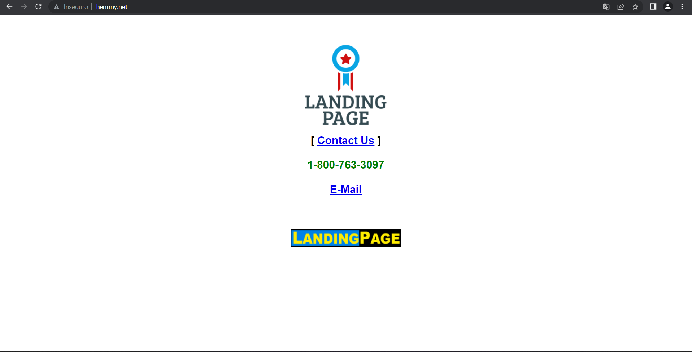
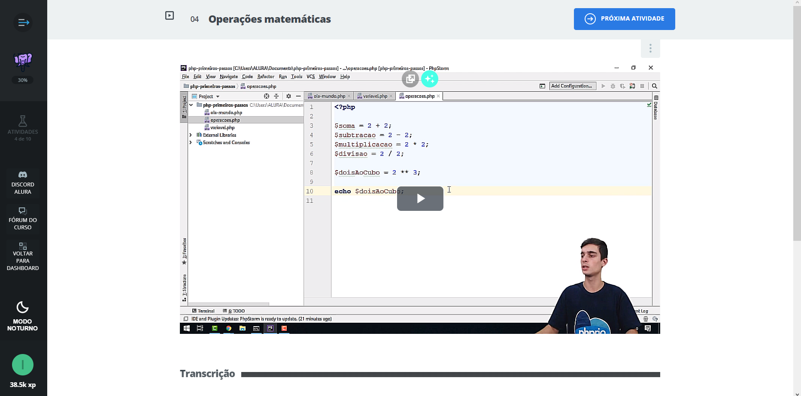
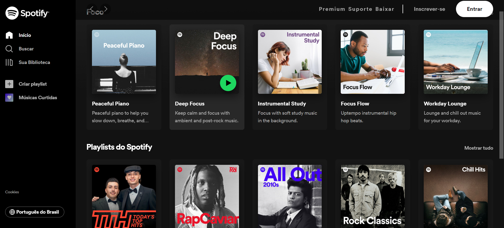
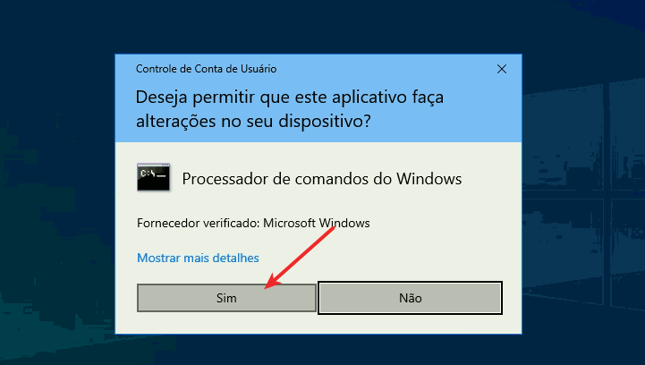
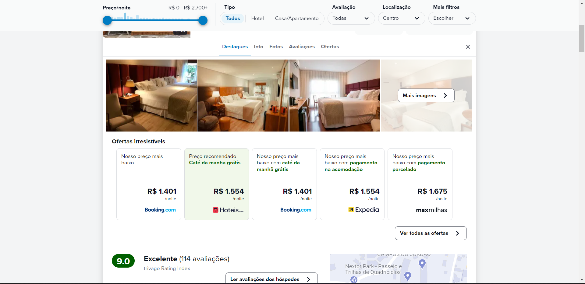
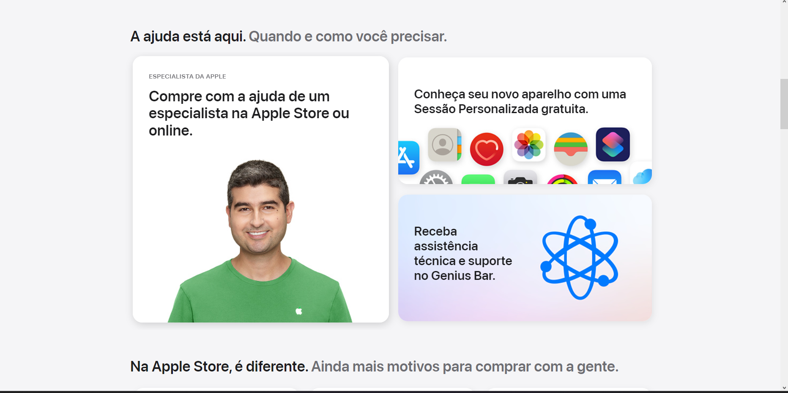

# IHC - Giuliano Bertoti
<h2>Repositório de Interação Humano Computador - Giuliano Bertoti</h2>

 
------------------------------------------------------

 

<h3>  IHC atual: o trabalho das heurísticas de usabilidade e acessibilidade avaliei formas convencionais de IHC: uma interação humano computador cujo fim é comprar um produto, marcar uma passagem, etc em uma interface gráfica convencional.</h3>

 

 <h3>HC futuro: no trabalho do artigo (que envolve pesquisa de papers exatamente por ser algo estado da arte) explorei a interação humano computador usando formas naturais como a "conversa" (que é algo extramamente humano).
 <h3>

  
  <break></break>
  
  <h1> 5 pontos negativos encontrados<h1>

  <h3>1 - Alistamento Militar

   

  

  <h4>Descição: Lei da heurística Nº 6: Reconhecimento em vez de lembrança;</h4>

   

  <h5>Com um desgin horrendo o site de alistamento militar já causou dor de cabeça aos jovens que tentaram se alistar online, com sua interface ruim gera um má recordação de lembrança e design ao usuário devido aos problemas ocorridos. </h5>

---------------------------------------

  <h3>2 - Extra Supermercados

   

  </img>

  <h4>Descição: Lei da heurística Nº 8: Design estético e minimalista;</h4>

 

  <h5>Sua interface extremamente poluída gera uma má experiência ao usuário,  mesmo sendo uma marca gigante nacional não investe em um site clean e interativo para melhorar a experiência do cliente </h5>

    

  --------------------------------

   <h3>3 e 4 - hemmy.net
     

  </img>

</img>

<h4>Descição: Lei da heurística Nº 8: Design estético e minimalista;</h4>

 

<h5> Hemmy é um site Norte Americano cujo sua intenção é mostrar ao contrário sobre as leis da heurística, com uma interfaçe totalmente desproporcional e ignorada as teorias das cores gera uma péssima interação com usuário, dependendo de casos específicos podendo gerar até um ataque de eplepsia. </h5>

 

<h1> 5 pontos Positivos encontrados</h1>

  <h3>1 - Alura</h3>

  </img>

   

   <h4>Descição: Lei da heurística Nº 3: Controle e liberdade do usuário;</h4>

     

<h5> Alura é um das maiores plataformas de ensino sobre programação, e por ser uma grande página deve fornecer credibilidade ao usuário, com uma plataforma usual e simples fornece todo suporte ao cliente que está usando </h5>

  

-----------------------------------

<h3>2 - Spotify

 

</img>

 

<h4>Descição: Lei da heurística Nº 7: Flexibilidade e eficiência de uso;</h4>

 

<h5> Spotify todos nós sabemos que é a maior plataforma de stream de músicas, com ela vem inclusas pacotes e personalizações para cada usuário, com gostos musicais e artistas preferidos, isso gera uma credibilidade e gosto em usar a plataforma </h5>  

 

--------------------------
<h3> 3- Permissão do Administrador</h3>

</img>
<h4>Descrição: lei da heuristica Nº 5: Prevenção de erros</h4>

<h5> Essa é uma das Heuristicas mais importantes poisgraças a ela dor de cabeça pode ser evitada, com um cookie, pop-up pu até mesmo uma tela de confirmação pode salvar seu usuário de algum erro  </h5>  
 

--------------------------
<h3> 4- Trivago</h3>

</img>

<h4>Descrição: Nº 7: Flexibilidade e eficiência de uso
</h4>

<h5> Trivago uma das maiores empresas de hóteis do mundo conta com uma ferramenta de personalização muito interessante para o cliente, com base em seus gostos e preferência  gera pacotes personalizados  </h5>  

 

--------------------------
<h3> 5- Site Da Apple</h3>

</img>

<h4>Descrição: Nº 8: Design estético e minimalista
</h4>

<h5> Apple é a maior referência em marketing e Identidade Visual, seu site com estética minimalista mas que oferece o que tem de melhor ao seu usuário </h5>  

    

